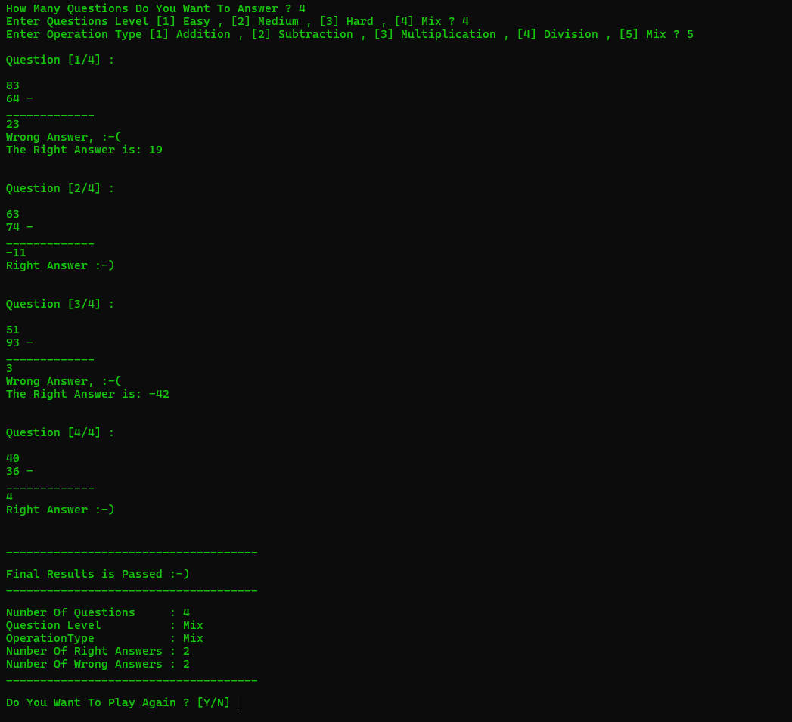

# Math Quiz Game (C++)

A console-based math quiz game written in C++.

## Features
- Choose the number of questions (1–10)
- Choose the difficulty: Easy, Medium, Hard, or Mix
- Choose the operation: addition, subtraction, multiplication, division, or Mix
- Division questions always have whole-number answers
- Instant feedback with colored screens (green for right, red for wrong)
- Final results summary (pass/fail, right and wrong answers)

## Concepts used
Structs, enums, functions, random number generation, and switch statements.

## How to run
Compile with any C++ compiler on Windows (the game uses `system("cls")` and `system("color")`):

    g++ main.cpp -o quiz
    quiz.exe

## Screenshot

